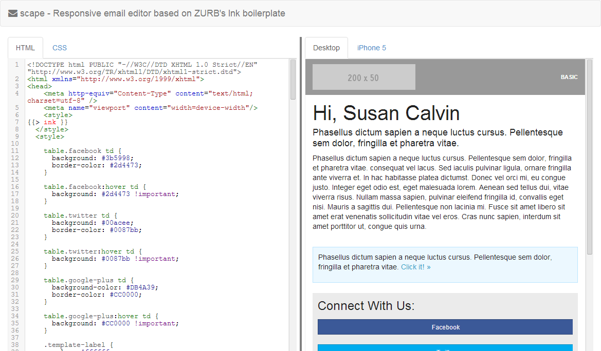

✎ scape
=======

Responsive email editor based on ZURB's Ink boilerplate

This is yet a very rough version of what to come... 

_scape_ allows you to create responsive emails directly in your browser and
shows you a preview for desktop and mobile devices in realtime, while you type.

_scape_ is based on the popular responsive email boilplate Ink by ZURB (zurb.com/ink/).
